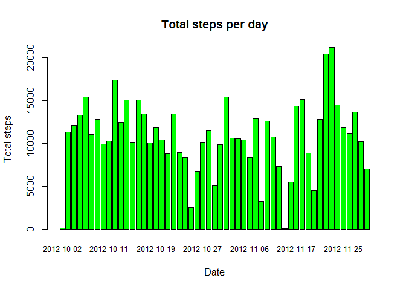
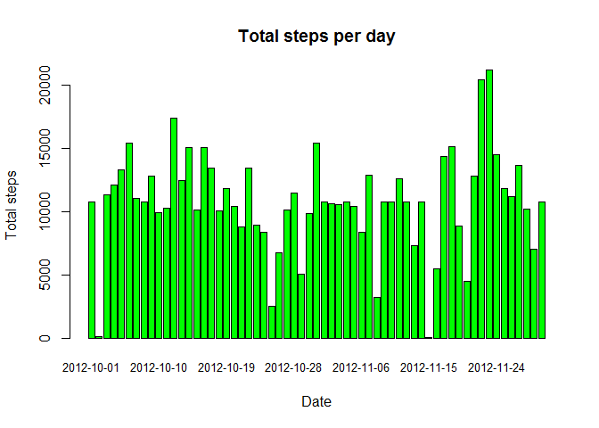
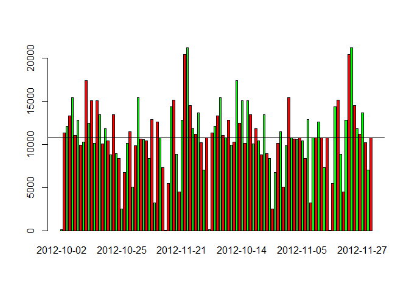
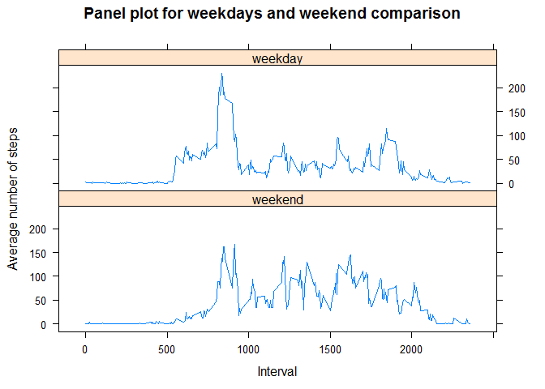

# Reproducible Research: Peer Assessment 1

## Prerequisite
In order to properly execute this report you need the following packages installed: 

* timeDate
* lattice


```r
library(timeDate)
```

```
## Warning: package 'timeDate' was built under R version 3.1.3
```

```r
library(lattice)
```

## Loading and preprocessing the data
1. The Activity monitoring data is provided as zip file which is first unzipped:


```r
unzip("activity.zip", exdir = "./data")
```
2. The unzipped comma-separated-value (CSV) file is now loaded and a summary is displayed:


```r
data <- read.csv("data/activity.csv", header = TRUE, sep = ",", na.strings = "NA")
data$date <- as.Date(data$date)
summary(data)
```

```
##      steps             date               interval     
##  Min.   :  0.00   Min.   :2012-10-01   Min.   :   0.0  
##  1st Qu.:  0.00   1st Qu.:2012-10-16   1st Qu.: 588.8  
##  Median :  0.00   Median :2012-10-31   Median :1177.5  
##  Mean   : 37.38   Mean   :2012-10-31   Mean   :1177.5  
##  3rd Qu.: 12.00   3rd Qu.:2012-11-15   3rd Qu.:1766.2  
##  Max.   :806.00   Max.   :2012-11-30   Max.   :2355.0  
##  NA's   :2304
```

```r
str(data)
```

```
## 'data.frame':	17568 obs. of  3 variables:
##  $ steps   : int  NA NA NA NA NA NA NA NA NA NA ...
##  $ date    : Date, format: "2012-10-01" "2012-10-01" ...
##  $ interval: int  0 5 10 15 20 25 30 35 40 45 ...
```

## What is mean total number of steps taken per day?
1. Calculate the total number of steps taken per day


```r
dataclean <- data[complete.cases(data),]
datasum <- aggregate(steps ~ date, dataclean, sum)
```

2. Display a histogram of the calculated steps per day


```r
barplot(datasum$steps, names.arg = datasum$date, col="green", border="black", 
        main = "Total steps per day", xlab = "Date", ylab = "Total steps", cex.names = 0.8)
```

 

3. Calculate and report the mean and median of the total number of steps taken per day


```r
mean(datasum$steps)
```

```
## [1] 10766.19
```

```r
median(datasum$steps)
```

```
## [1] 10765
```


## What is the average daily activity pattern?

1. Make a time series plot (i.e. type = "l") of the 5-minute interval (x-axis) and the average number of steps taken, averaged across all days (y-axis)


```r
dataavg <- aggregate(steps ~  interval, dataclean, mean)
#plot(dataavg$interval, dataavg$steps, type="l", 
#     main = "Average number of steps by the 5-minute interval", 
#     xlab = "5-minute interval", ylab = "Average steps per interval")
```
    
2. Which 5-minute interval, on average across all the days in the dataset, contains the maximum number of steps?


```r
dataavg[which.max(dataavg$steps), 1]
```

```
## [1] 835
```


## Imputing missing values

1. Calculate and report the total number of missing values in the dataset (i.e. the total number of rows with NAs)


```r
sum(is.na(data))
```

```
## [1] 2304
```

2. Strategy for filling in all of the missing values is applied by using the mean for that 5-minute interval.

3. Create a new dataset that is equal to the original dataset but with the missing data filled in.

* Create a new dataset which will be used to input missing values


```r
datanew <- data
```

* Already calculated 'dataavg' is reused to input missing values into 'datanew'

* Calculate index of missing values

```r
index_na <- which(is.na(datanew$steps)) 
```

* Loop over the calculated index of missing values 'index_na' and replace the NA in variable 'steps' with the calculated 'dataavg' values for the corresponding index.


```r
for (i in index_na) {
    datanew$steps[i] <- with(dataavg, steps[interval == datanew$interval[i]])
}
```
* Verify that all NA values were replaced. Following code should result in 0.


```r
sum(is.na(datanew))
```

```
## [1] 0
```

* Calculate sum of steps per day


```r
datanewsum <- aggregate(steps ~ date, datanew, sum)
```

4. Make a histogram of the total number of steps taken each day and Calculate and report the mean and median total number of steps taken per day. Do these values differ from the estimates from the first part of the assignment? What is the impact of imputing missing data on the estimates of the total daily number of steps?

* Display a histogram of the calculated steps per day


```r
barplot(datanewsum$steps, names.arg = datanewsum$date, col="green", border="black", 
        main = "Total steps per day", xlab = "Date", ylab = "Total steps", cex.names = 0.8)
```

 

* Calculate and report the mean and median of the total number of steps taken per day


```r
mean(datanewsum$steps)
```

```
## [1] 10766.19
```

```r
median(datanewsum$steps)
```

```
## [1] 10766.19
```

* Combine previous calculated steps per day with new calculated steps per day with inputed NA values


```r
datacombined <- rbind(datasum, datanewsum)
```

* Dsiplay a combined histogram of the calculated steps per day to display differences. Include also a line which indicates the mean for both datasets


```r
barplot(datacombined$steps, beside = TRUE, names.arg = datacombined$date, col=c("green", "red"))
abline(h=mean(datasum$steps))
abline(h=mean(datanewsum$steps))
```

 

## Are there differences in activity patterns between weekdays and weekends?

1. Create a new factor variable in the dataset with two levels - "weekday" and "weekend" indicating whether a given date is a weekday or weekend day.


```r
datanew$daytype <- factor(isWeekday(datanew$date), labels = c("weekend", "weekday"))
str(datanew)
```

```
## 'data.frame':	17568 obs. of  4 variables:
##  $ steps   : num  1.717 0.3396 0.1321 0.1509 0.0755 ...
##  $ date    : Date, format: "2012-10-01" "2012-10-01" ...
##  $ interval: int  0 5 10 15 20 25 30 35 40 45 ...
##  $ daytype : Factor w/ 2 levels "weekend","weekday": 2 2 2 2 2 2 2 2 2 2 ...
```

2. Make a panel plot containing a time series plot (i.e. type = "l") of the 5-minute interval (x-axis) and the average number of steps taken, averaged across all weekday days or weekend days (y-axis). See the README file in the GitHub repository to see an example of what this plot should look like using simulated data.

* Calculate average for interval


```r
datanewavg <- aggregate(steps ~ interval+daytype, datanew, mean)
```

* Create scatter plot with a panel for each daytype


```r
xyplot(datanewavg$steps~datanewavg$interval|datanewavg$daytype, type="l", layout = c(1, 2),
   main="Panel plot for weekdays and weekend comparison",
   ylab="Average number of steps", xlab="Interval")
```

 

